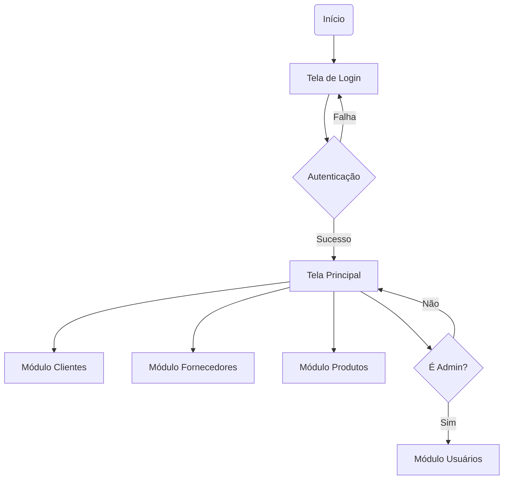

# 📦 Sistema Comércio POO - Trabalho P1

Este projeto é o **Trabalho de POO - P1**, desenvolvido para a disciplina de Programação Orientada a Objetos. O sistema consiste em uma aplicação desktop para gestão comercial, consolidando conceitos de POO, encapsulamento e interfaces gráficas.

---

## 🎯 Funcionalidades Implementadas

O sistema permite a gestão completa de quatro entidades fundamentais através de operações de:
- **🔍 Consulta**: Visualização dinâmica de registros através de seletores.
- **➕ Inserção**: Cadastro de novos registros com validação de campos.
- **📝 Alteração**: Edição de dados existentes com persistência em memória.

### 🔐 Controle de Acesso
O sistema conta com uma tela de login e diferenciação de permissões:
- **Nível ADMIN**: Acesso total ao sistema, incluindo o gerenciamento de novos usuários.
- **Nível USUARIO**: Acesso limitado aos cadastros operacionais (Clientes, Fornecedores e Produtos).

**Credenciais Padrão:**
- **Usuário:** `admin`
- **Senha:** `admin123`

---

## 🚀 Entidades Gerenciadas

- **👤 Cadastro de Usuários**: Gestão de operadores (exclusivo para administradores).
- **👥 Cadastro de Clientes**: Controle de CPF, contato e endereço.
- **⚙️ Gestão de Produtos**: Controle de itens vinculados a fornecedores.
- **🏢 Gestão de Fornecedores**: Registro e vinculação de parceiros comerciais.

---

## 🛠️ Tecnologias e Arquitetura

- **Linguagem**: Java 8+.
- **GUI**: Desenvolvido com **Java Swing** e **AWT** (layouts responsivos com `GroupLayout`).
- **Persistência**: Armazenamento em memória utilizando `ArrayList` e passagem de referências entre telas.
- **Padrões**: Encapsulamento de atributos, uso de Enums para níveis de acesso e composição de objetos.

---

## 📂 Fluxo do Sistema

---

## 💻 Como Executar

1. Abra o projeto no **Apache NetBeans**.
2. Certifique-se de possuir o JDK configurado (versão 8 ou superior).
3. Execute a classe principal `Projeto.java` localizada no pacote `projeto`.

---
Desenvolvido por **Jose Elias** como parte da avaliação de POO - P1.
